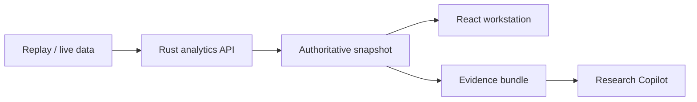

# VolScope

Evidence-grounded options research workstation with point-in-time replay,
volatility analytics, strategy risk analysis, and a read-only research copilot.

[中文说明](README.zh-CN.md) · [Architecture](docs/ARCHITECTURE.md) ·
[API](docs/API.md) · [Data contract](docs/DATA_SOURCES.md) ·
[Model limitations](docs/MODEL_LIMITATIONS.md)

> VolScope is research software, not investment advice. It does not promise
> returns, expose real-money execution, or redistribute market data.


## Why VolScope

Many options dashboards show derived metrics without making data quality,
timing, pricing assumptions, or model ownership visible. VolScope uses a more
explicit pipeline:

```text
licensed market data
        ↓
point-in-time snapshot + quality gates
        ↓
deterministic Rust analytics
        ↓
structured evidence
        ↓
human interpretation / Research Copilot
```

The language layer never owns market facts. IV, Greeks, SVI, volatility
context, dealer exposure, payoff, and scenario PnL remain server-calculated.
When evidence is stale or incomplete, the affected conclusion is blocked.

## Research Copilot V0

The Copilot answers bounded questions about the active replay or live snapshot:

- Is implied volatility expensive relative to RV20?
- What gamma regime does the selected dealer model imply?
- Which metrics are blocked by current data quality?
- What does the current replay frame show?

Every numeric claim cites structured evidence such as `[E2] ATM IV`, `[E4]
VRP20`, or `[E9] fresh quote coverage`. The Rust server reloads the
authoritative snapshot for every request instead of trusting browser-supplied
analytics.

V0 uses deterministic answer templates and requires no model key. A future
OpenAI-compatible provider may improve language understanding while remaining
bounded by the same evidence contract.

## Core capabilities

- Minute-level historical replay from operator-owned Parquet partitions.
- One authoritative snapshot binding chain, surface, and volatility context.
- BSM pricing, implied-volatility inversion, and Greeks.
- SVI fitting, term structure, constrained surface, and arbitrage diagnostics.
- RV5/RV10/RV20, IV rank, IV percentile, VRP20, and expected move.
- GEX, Vanna, Charm, call/put walls, and gamma-flip scenarios.
- Multi-leg strategy analysis using executable bid/ask sides.
- Live Longbridge quotes and tightly gated paper-account operations.
- Redacted append-only audit records with hash-chain verification.

## Architecture



| Layer | Technology | Responsibility |
| --- | --- | --- |
| Frontend | React 19, Vite, ECharts | Workstation, replay, charts, Copilot UI |
| Production API | Rust, Axum, Tokio | Validation, analytics, state, safety gates |
| Historical data | Arrow, Parquet | Point-in-time replay partitions |
| Live provider | Longbridge Rust SDK | Quotes, subscriptions, paper operations |
| Legacy reference | FastAPI | Migration parity only; not used in production |

The production server lives in `rust-backend/`. The Python `backend/` directory
must never receive provider credentials.

## Quick start

Requirements: Rust stable, Node.js 22, npm, and optionally Python 3.11+ for
legacy parity tests.

```bash
git clone https://github.com/Idislikedrinkamericano/volscope.git
cd volscope
cp .env.example .env
make setup
make run
```

Open <http://127.0.0.1:7311>. Without replay data, the service still starts but
the historical catalog is empty.

Docker:

```bash
cp .env.example .env
docker compose up --build
```

The application binds to `127.0.0.1:7311` by default. It is a local single-user
tool and should not be exposed directly to the public internet.

## Replay data

Market data is not included.

```text
data/
├── underlying/symbol=SPY/date=2026-07-10/ohlc.parquet
└── options/symbol=SPY/date=2026-07-10/expiration=2026-07-17/
    ├── quote_1m.parquet
    └── open_interest.parquet
```

See [docs/DATA_SOURCES.md](docs/DATA_SOURCES.md) for schemas, timestamps,
point-in-time rules, and licensing boundaries.

## Configuration

| Variable | Default | Purpose |
| --- | --- | --- |
| `VOLSCOPE_DATA_ROOT` | `./data` | Replay-data root |
| `VOLSCOPE_HOST` | `127.0.0.1` | Bind address |
| `VOLSCOPE_PORT` | `7311` | HTTP/WebSocket port |
| `VOLSCOPE_RISK_FREE_RATE` | `0.043` | BSM rate assumption |
| `VOLSCOPE_FRONTEND_DIST` | `./frontend/dist` | Built frontend directory |
| `VOLSCOPE_AUDIT_PATH` | `~/.volscope/audit.jsonl` | Local audit ledger |
| `VOLSCOPE_PAPER_ORDER_EXECUTION` | unset | Paper-order master gate |

Do not store Longbridge credentials in `.env`. Enter them only through the
local connection panel; the Rust process keeps them in memory.

## Verification

```bash
make check
make security
```

Or run individual checks:

```bash
cargo test --locked --manifest-path rust-backend/Cargo.toml
cd frontend && npm ci && npm run build
python3 -m pytest -q
```

## Roadmap

1. Add an OpenAI-compatible provider behind the evidence validator.
2. Persist replay hypotheses and evaluate them against later observations.
3. Add Merton jump-diffusion strategy EV as an explicit scenario model.
4. Expand synthetic fixtures and end-to-end Copilot tests.

## Provenance and license

VolScope adapts the supplied Option Workstation codebase. Original copyright
and attribution remain in [NOTICE](NOTICE); third-party notices remain in
[THIRD_PARTY_NOTICES.md](THIRD_PARTY_NOTICES.md).

Source code is licensed under the [Apache License 2.0](LICENSE). Market-data
licenses remain the operator's responsibility.
