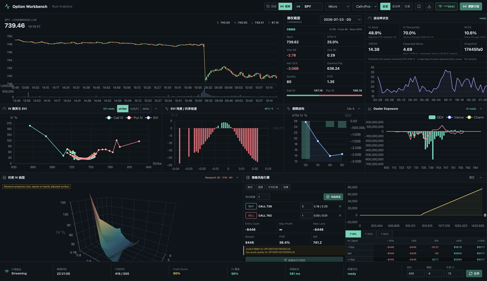

# VolScope

一个以证据为中心的期权研究工作台，提供历史回放、波动率分析、策略风险评估，
以及只读的 Research Copilot。

[English README](README.md) · [系统架构](docs/ARCHITECTURE.md) ·
[API](docs/API.md) · [数据契约](docs/DATA_SOURCES.md) ·
[模型边界](docs/MODEL_LIMITATIONS.md)

> VolScope 是研究软件，不构成投资建议，不承诺收益，不提供实盘下单能力，也不附带或
> 转发行情数据。



## 核心思路

很多期权工具会显示 IV、Greeks、GEX 或策略收益图，却没有明确告诉用户数据是否新鲜、
指标是否真的可计算，以及采用了什么模型假设。VolScope 将流程拆成：

```text
合法获得的市场数据
        ↓
时间点快照与质量门禁
        ↓
Rust 确定性计算
        ↓
结构化证据
        ↓
人工解释 / Research Copilot
```

语言模型不拥有市场事实。IV、Greeks、SVI、GEX、PnL 和 EV 等数值必须由后端计算；
当数据不足时，系统返回不可用原因，而不是补出一个数字。

## Research Copilot V0

当前 Copilot 可以围绕正在查看的 replay/live 截面回答：

- 当前 IV 相对 RV20 是否偏贵？
- 当前 dealer model 对应什么 Gamma 状态？
- 哪些指标被数据质量门禁阻止？
- 当前回放分钟的期权截面有什么值得注意？

回答中的数值会引用 `[E#]` 证据。每次提问时，Rust 后端都会重新读取权威快照，
而不是相信浏览器传来的分析数字。

V0 使用 deterministic 模板，无需模型 API Key。下一阶段可以接入百炼等
OpenAI-compatible provider，但模型仍必须服从同一套证据校验。

## 主要功能

- 分钟级历史回放与 point-in-time 数据边界。
- Chain、Surface、Volatility Context 绑定同一 snapshot。
- BSM、隐含波动率反解和 Greeks。
- SVI、期限结构、受约束波动率曲面和套利诊断。
- RV5/RV10/RV20、IV Rank、IV Percentile、VRP20 和 Expected Move。
- GEX、Vanna、Charm、Call/Put Wall 与 Gamma Flip。
- 严格使用 Bid/Ask 方向的多腿策略分析和 Scenario PnL。
- Longbridge 实时行情与受服务端门禁保护的模拟账户操作。
- 脱敏、可检测篡改的审计记录。

## 技术架构

| 层 | 技术 | 职责 |
| --- | --- | --- |
| 前端 | React 19、Vite、ECharts | 工作台、回放、图表和 Copilot UI |
| 生产后端 | Rust、Axum、Tokio | 验证、分析、状态管理和安全门禁 |
| 历史数据 | Arrow、Parquet | 用户自行管理的时间点分区 |
| 实时数据 | Longbridge Rust SDK | 行情订阅和模拟账户操作 |
| 旧版参考 | FastAPI | 仅用于迁移对照，不参与正式运行 |

正式服务位于 `rust-backend/`。`backend/` 只是 Python 对照实现，不能接收任何凭证。

## 快速启动

需要 Rust stable、Node.js 22 和 npm；Python 3.11+ 只用于旧版对照测试。

```bash
git clone https://github.com/Idislikedrinkamericano/volscope.git
cd volscope
cp .env.example .env
make setup
make run
```

打开 <http://127.0.0.1:7311>。没有历史数据时服务仍能启动，但 replay catalog 为空。

Docker：

```bash
cp .env.example .env
docker compose up --build
```

默认只监听 `127.0.0.1:7311`。这是本地单用户应用，不应直接暴露到公网。

## 历史数据

仓库不包含任何市场数据。

```text
data/
├── underlying/symbol=SPY/date=2026-07-10/ohlc.parquet
└── options/symbol=SPY/date=2026-07-10/expiration=2026-07-17/
    ├── quote_1m.parquet
    └── open_interest.parquet
```

字段、时区、回放边界和数据许可见 [docs/DATA_SOURCES.md](docs/DATA_SOURCES.md)。

## 验证

```bash
make check
make security
```

## 下一步

1. 在 evidence validator 后接入 OpenAI-compatible provider。
2. 保存 replay hypothesis，并在后续时间点自动评估。
3. 加入 Merton Jump Diffusion 策略 EV 场景模型。
4. 增加 synthetic fixtures 和端到端 Copilot 测试。

## 来源与许可证

VolScope 基于用户提供的 Option Workstation 代码库继续开发。原作者版权与署名保留在
[NOTICE](NOTICE)，第三方依赖声明保留在
[THIRD_PARTY_NOTICES.md](THIRD_PARTY_NOTICES.md)。

源码采用 [Apache License 2.0](LICENSE)。市场数据许可与源码许可相互独立。
